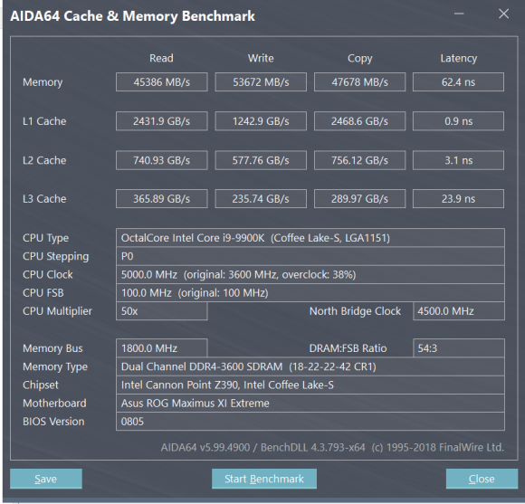
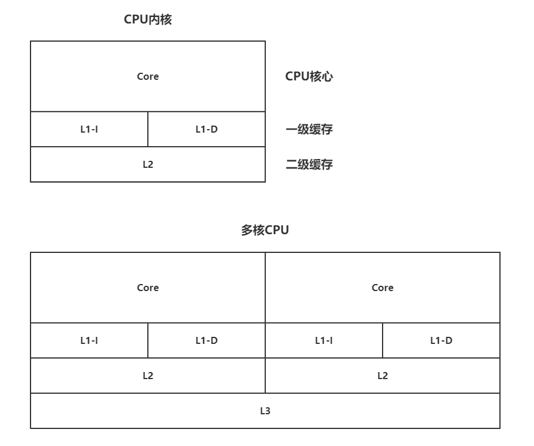
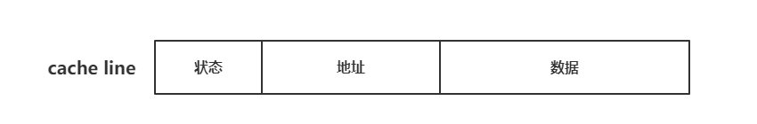

# Concurrent programming
## 一、JMM & volatile
### 1.1 现代计算机模型
现代计算机模型是基于冯·诺依曼计算机模型。计算机在运行时，先从内存中取出第一条指令，通过控制器的译码，按指令要求，从存储器中取出数据进行指定的运算和逻辑操作等加工，然后再按地址把结果送到内存中去。接下来，再取出第二条指令，在控制器的指挥下完成规定操作，依此进行，直到遇到停止指令。
- **程序和数据一样存贮，按程序编排的顺序，一步步取出指令，自动的完成指令规定的操作是计算机最基本的工作模型。这一原理最初由美籍匈牙利数学家冯·诺依曼于1945年提出，故称冯·诺依曼计算机模型。**

**五大核心组成部分：**
- 控制器：主要用来控制和指挥程序与数据的输入运行，以及运算结果的处理
- 运算器：主要运行算数运算和逻辑运算，并将中间结果暂存到运算器
- 存储器：存放程序和数据
- 输入设备：将信息转换为机器能够识别的信息形式输入到计算机，如鼠标、键盘
- 输出设备：输出计算机指令执行后的数据，如显示器、打印机

### 1.2 CPU
CPU(central processing unit)，即中央处理器。在冯·诺依曼计算机体系中，CPU一般由控制器和运算器组成。
现代计算机的CPU硬件结构分为控制单元、运算单元和存储单元。这里说一个点，关于**CPU的三级缓存架构**

#### - 为什么CPU Cache要设计L1、L2、L3三级缓存呢？
众所周知，目前市场上的CPU运算性能相当之高，频率动则3~4GHz，单核睿频更是超5GHz以上。但是计算机其他组件的运算速率是达不到如此之高的，比如说与CPU交互最为频繁的内存。频率达到4000MHz的DDR4内存已经算是顶级内存了。CPU通过I/O总线和内存进行数据交互，显然内存的速度远远不及CPU，如果每次读取指令和数据都要等待内存读取到，那么便白白浪费了大量CPU性能。此时CPU缓存的作用就体现出来了，将一部分指令和数据读取到缓存中执行操作，再等待下一批指令和数据的到来。因此CPU的缓存越大，能存储的指令和数据越多，与内存之间的数据交互次数就越少，CPU的运行效率也就越高。那么这时又引出两个问题，内存频率为什么不能做到很高呢，如果做不到很高那CPU缓存做大一点不行吗？其实这两个问题有相同的答案，先说说缓存。如果对主机比较感兴趣的朋友都知道，CPU的缓存是很小的，比如目前市场比较火的Intel酷睿i9-9900K和AMD Ryzen 9 3800X：
||Intel® Core™ i9-9900K|AMD Ryzen™ 7 3800X|
|:-:|:-:|:-:|
|L1 Cache|512KB|512KB|
|L2 Cache|2MB|4MB|
|L3 Cache|16MB|32MB|

看到这个对比图我们会发现CPU缓存小的可怜，那么再来看一张图：:scream:

不要惊讶:smirk:，这就是CPU缓存的读写速度，快的令人发指。这种高速缓存的成本是非常高的，加上这种高速缓存均由静态RAM组成，结构较复杂，在有限的CPU芯片面积上容量做大不太可能。其次，缓存也是处理器中的发热大户，设计太大容量所带来的发热量将会非常"可观"。综合成本等因素，CPU的缓存设计在了合理的大小。

再来说说内存。如今的计算机内存容量其实挺可观的，8g内存容量已过时，16g基本成为标配。如此大的容量如果要做到CPU高速缓存的级别，就成本而言便不太现实，再者巨大的发热量也是棘手的问题。

#### - 关于L1/L2/L3三级缓存
由于CPU的运算速度超越了L1缓存的数据I/O能力，于是CPU厂商又引入了多级缓存的结构。上图我们能明显看出三级缓存的速度是递减的。在CPU架构中还有一个寄存器，速度比L1 Cache还快。所以速度由高到低排序：:zap:  寄存器 > L1 > L2 > L3  :turtle:
- **CPU Cache结构图：**

L1 Cache还分为数据缓存D-Cache(Data Cache)和指令缓存I-Cache(Instruction Cache)。二者分别用来存放数据和执行指令，而且可以同时被CPU访问，减少了争用Cache所造成的冲突，提高了处理器效能。受成本及CPU内部结构的限制，各CPU产品之间一级缓存容量都相差不大，那么二级缓存的容量则是提高CPU性能的关键。二级缓存容量的提升是CPU制造工艺所决定的，容量增大必定导致CPU内部晶体管数量的增加。要在有限的CPU面积上集成更大的缓存，对制造工艺的要求也就越高。L1/L2缓存封装在CPU内核中，L3缓存不在内核内。多核CPU的L3缓存是共享的，L1/L2缓存与CPU同频，速度快延迟小，L3缓存与总线同频。缓存的工作原理是当CPU要读取一个数据时，先从缓存中查找，如果找到就立即读取并送给CPU处理。这里说一个概念，CPU在缓存中找到有用数据被称为**命中**。当缓存中没有CPU所需的数据时（未命中），CPU才访问内存。按理论，在一颗拥有二级缓存的CPU中，读取一级缓存的命中率为80%。也就是说80%的有用数据CPU能在一级缓存中找到，剩下的20%从二级缓存中读取。由于不能准确预测将要执行的数据，读取二级缓存的命中率也在80%左右（从二级缓存读取到的有用数据占总数据的16%）。早期CPU只有二级缓存，那么还有的数据就不得不从内存读取调用，但这已经是非常小的比例了。现在的CPU基本都带有三级缓存，三级缓存是为CPU读取二级缓存后未命中的数据设计的一种缓存，在拥有三级缓存的CPU中，只有约5%的数据需要从内存中读取，这进一步提高了CPU的效率。

***对比下AMD给的缓存，最后唠一句，农企良心*** :joy:

### 1.3 缓存一致性问题
在多核CPU中，每个CPU内核都有自己的高速缓存，它们共享同一主内存（Main Memory）。这种基于高速缓存的存储交互很好的解决了处理器与内存的速度矛盾，但在此场景下也引入了新问题：缓存一致性（Cache Coherency）。当多个CPU内核的运算任务都涉及同一块主存区域时，可能导致各自缓存数据不一致的情况，如果发生这种情况，那同步回主内存时以谁的缓存数据为准呢？为了解决一致性问题，需要各CPU内核访问缓存时都遵循一些协议，在读写时需根据协议来进行操作。这里我们说一种缓存一致性协议，**MESI**。

#### - cache line
在说MESI之前我们先说说缓存行cache line。缓存由缓存行组成，缓存行是缓存和内存数据交换的最小单位。目前处理器常见的缓存行大小为64Byte（早期较旧的处理器缓存行为32Byte）。当多个线程对同一个缓存行访问时，其中一个线程会锁住缓存行，然后操作，这个时候其他线程无法操作缓存行。

MESI协议将cache line的状态分为modify、exclusive、shared、invalid，分别是修改、独占、共享和失效。在MESI协议中，cache line状态可以是M、E、S、I，地址则是cache line中映射的内存地址，数据是从内存中读取的数据。
- modified：当前CPU cache拥有最新数据（最新的cache line），其他CPU拥有失效数据（cache line的状态是invalid），虽然当前CPU cache中的数据和主存不一致，但以当前CPU cache的数据为准
- exclusive：只有当前CPU有数据，其他CPU中没有该数据，当前CPU cache中的数据和主存一致
- shared：当前CPU和其他CPU中有共同数据，且与主存中的数据一致
- invalid：当前CPU中的数据失效，数据应重新从主存中获取，当前CPU中的数据是被认为和主存不一致的

#### - MESI
|状态|描述|监听任务|
|:-|:-|:-|
|M 修改（Modified）|该cache line有效，数据被修改了，和内存中的数据不一致，数据只存在于本cache中|缓存行必须时刻监听所有其他内核试图读主存中该缓存行的操作，这种操作在缓存将该缓存行写回主存并将状态变为S（共享）状态之前被延迟执行|
|E 独享/互斥（Exclusive）|该cache line有效，数据和内存中的数据一致，数据只存在于本cache中|缓存行必须监听其他内核读主存中该缓存行的操作，一旦有这种操作，该缓存行需变为S（共享）状态|
|S 共享（Shared）|该cache line有效，数据和内存中的一致，且数据存在于多个cache中|缓存行必须监听其他内核使该缓存行无效或独享该缓存行的请求，并将该缓存行变为I（无效）状态|
|I 无效（Invalid）|该cache line无效|无|

#### - MESI Invalid
这里再说一点，MESI缓存一致性协议**并非一直有效**。当从主存读取到单个数据的存储跨缓存行操作时，MESI便失效了，此时只能通过总线加锁来实现缓存一致。

### 1.4 指令重排问题
